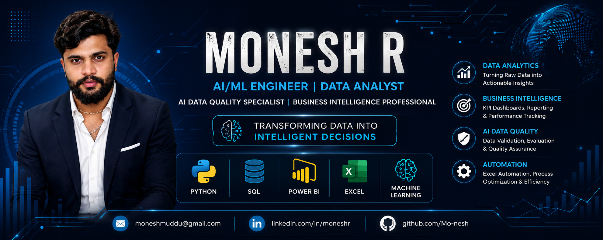

  

# Hi 👋, I'm Monesh R

### AI/ML Engineer • Data Analyst • AI Data Quality Specialist • Business Intelligence

🎓 **B.E. in Artificial Intelligence & Machine Learning (2025)**  
💼 **Operations & Data Analytics Associate at BASE Educational Services Pvt. Ltd.**  
📍 **Bengaluru, Karnataka, India**

---

## 👨‍💻 About Me

I am an Artificial Intelligence & Machine Learning graduate with professional experience in **Data Analytics, AI Data Quality, Business Intelligence, Dashboard Development, Reporting Automation, Educational Analytics, and Process Optimization.**

My career spans AI Data Quality, Business Analytics, Marketplace Analytics, and Educational Analytics, where I transform raw data into meaningful insights that support strategic decision-making and operational excellence.

I enjoy solving real-world business problems through **Python, SQL, Power BI, Advanced Excel, Machine Learning, and AI-assisted automation**, while continuously expanding my expertise in **Generative AI, Large Language Models (LLMs), Data Engineering, and MLOps.**

---

# 💼 Professional Experience

## 💼 Operations & Data Analytics Associate
### BASE Educational Services Pvt. Ltd.

**Key Contributions**

- Designed Academic Analytics dashboards
- Developed Student Performance Analytics reports
- Built Question Paper Analysis Frameworks
- Automated reporting workflows using Advanced Excel
- Developed interactive Power BI dashboards
- Supported AI-assisted workflow automation
- Improved educational data quality through validation and standardization
- Delivered analytical insights for academic and operational decision-making

---

## 📊 Data Analyst — AI Control Tower Project
### Nia.one (Umoja Marketplace)

**Key Contributions**

- Designed Business Intelligence dashboards
- Performed Attrition Analysis
- Conducted Employee Retention Analysis
- Built Cohort Analysis reports
- Developed Funnel Analysis dashboards
- Created Trend & Flow Analysis reports
- Built KPI dashboards for leadership
- Generated executive business reports
- Performed Data Validation & Quality Assurance
- Supported strategic business decisions through analytics

---

## 🤖 AI Data Quality Analyst Intern
### Rooman Technologies Pvt. Ltd.

**Key Contributions**

- Validated AI datasets for quality and consistency
- Performed data annotation and verification
- Executed dataset cleaning and preprocessing
- Conducted AI output evaluation
- Performed prompt testing and validation
- Measured AI quality metrics
- Prepared Excel-based quality reports
- Improved dataset accuracy for AI applications

---

# 🛠 Technical Skills

### Programming

- Python
- SQL

### Data Analytics

- Power BI
- Advanced Microsoft Excel
- Dashboard Development
- Data Visualization
- Business Intelligence
- KPI Reporting
- Reporting Automation
- Student Performance Analytics

### Analytics

- Attrition Analysis
- Retention Analysis
- Cohort Analysis
- Funnel Analysis
- Trend Analysis
- Flow Analysis
- Data Profiling
- Data Cleaning
- Data Validation
- Process Automation

### AI & Machine Learning

- Machine Learning
- AI Data Quality
- Prompt Engineering
- AI Evaluation
- Dataset Validation

### Libraries

- Pandas
- NumPy
- Matplotlib
- Scikit-learn

### Tools

- Git
- GitHub
- VS Code
- Jupyter Notebook
- Microsoft Excel
- Power BI Desktop

---

# 🚀 Featured Projects

📊 Student Performance Analytics Dashboard

📚 Question Paper Analysis Framework

📈 Business Intelligence Dashboard

🤖 AI Data Quality Validation Framework

⚙️ Excel Reporting Automation Suite

🐍 Python Data Analytics Toolkit

📉 Attrition & Retention Analytics

📊 Cohort, Funnel & Trend Analysis

---

# 🌱 Currently Learning

- Generative AI
- Large Language Models (LLMs)
- MLOps
- Data Engineering
- Cloud Technologies
- Advanced Machine Learning
- AI Automation

---

# 🎯 Career Interests

- Artificial Intelligence
- Machine Learning
- Data Analytics
- Business Intelligence
- AI Data Quality
- Data Engineering
- Analytics Automation
- Generative AI

---

# 📊 GitHub Statistics

---

# 📫 Connect With Me

- 📧 **Email:** moneshmuddu@gmail.com
- 💼 **LinkedIn:** [linkedin.com/in/moneshr](https://www.linkedin.com/in/moneshr)
- 🐙 **GitHub:** [github.com/monesh-r](https://github.com/monesh-r)
- 📄 **Resume:** [📥 Download My Resume](./Monesh_R_AI_Data_Analyst_Resume.pdf)

---

# ⭐ Thank You for Visiting!

### *"Transforming Data into Intelligent Decisions through Analytics, AI, and Automation."* 🚀
